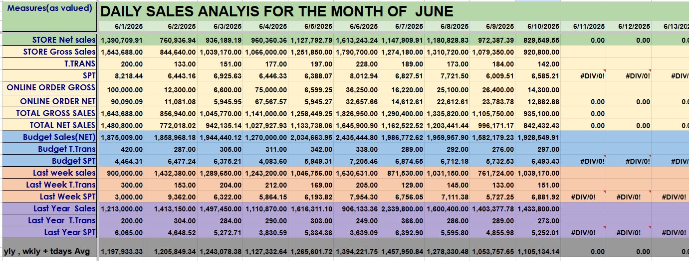

## Sales Analysis

Plain-language documentation of a simple sales analysis with linked data files and an embedded image. No Python/Jupyter required.

### Data Files
- [SalesAnalysis..csv](SalesAnalysis..csv)
- [SimpleSalesReport .xlsx](SimpleSalesReport%20.xlsx)

### Visual


### What this includes
- A CSV and an Excel workbook containing the raw/cleaned sales data
- A single image summarizing the key visual from the analysis
- This README for context and navigation

### How to use
- Click the links above to preview/download the data on GitHub
- The image renders directly on GitHub; open it full-size for details
- Open the Excel file to explore pivots/tables or build your own charts

### Repository structure
```text
sales-Analysis/
  README.md
  SalesAnalysis..csv
  SimpleSalesReport .xlsx
  sales.png
```


